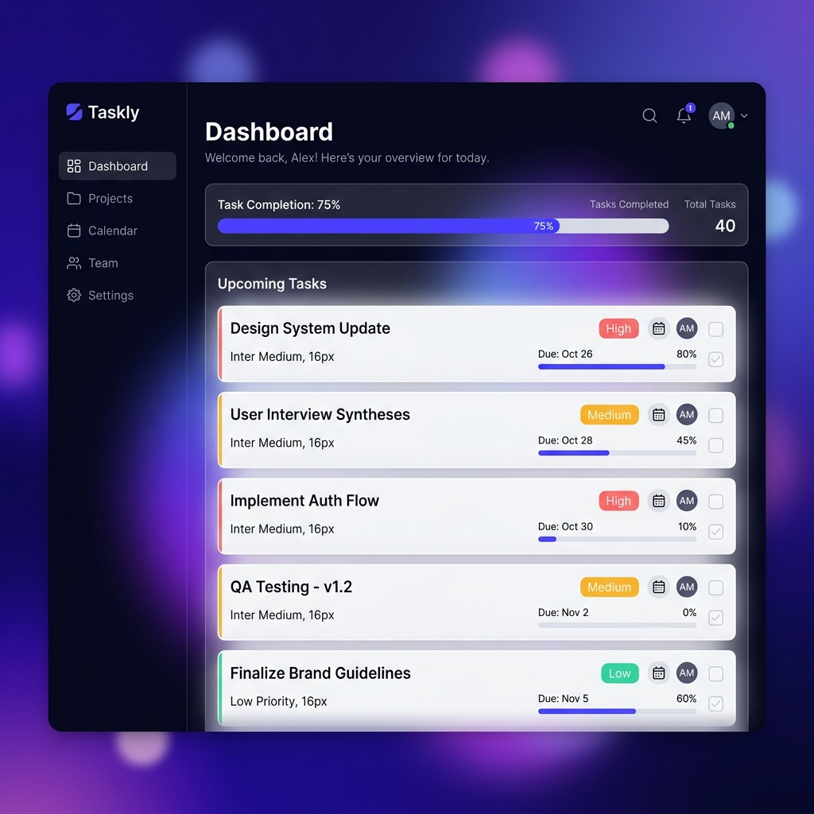

# 🚀 Taskly - Professional Task Manager

Taskly is a premium, high-performance task management application built with **React**, **CSS Modules**, and **Framer Motion**. It features a modern glassmorphism design with advanced task handling capabilities like priorities, due dates, and real-time filtering.



## ✨ Key Features

- **Professional Dashboard**: Stunning glassmorphism UI with a vibrant gradient background.
- **Priority System**: Organize tasks with High, Medium, and Low priority tags.
- **Due Dates**: Never miss a deadline with integrated date tracking.
- **Dynamic Search & Filters**: Instantly find tasks by name or status (All, Pending, Completed).
- **Inline Editing**: Quick and intuitive task title updates within the list.
- **Visual Progress**: Real-time progress bar tracking your completion rate.
- **Smooth Animations**: Powered by Framer Motion for a premium, responsive feel.
- **Persistence**: Automatic sync with `localStorage` keeps your data safe.

## 🛠️ Technology Stack

- **Core**: React 18+ (Hooks)
- **Styling**: CSS Modules (Vanilla CSS)
- **Animations**: Framer Motion
- **Icons**: Lucide React
- **Build Tool**: Vite

## 🚀 Getting Started

### Prerequisites

- Node.js (v18 or higher)
- npm or yarn

### Installation

1. Clone the repository:
   ```bash
   git clone https://github.com/uttarakavatamteja-collab/task-manager-app.git
   ```

2. Navigate to the project directory:
   ```bash
   cd task-manager-app
   ```

3. Install dependencies:
   ```bash
   npm install
   ```

4. Start the development server:
   ```bash
   npm run dev
   ```

## 📱 Responsive Performance

Taskly is built with a **mobile-first** approach, ensuring an exceptional experience on smartphones, tablets, and desktops alike.

## 📄 License

Distributed under the MIT License.
